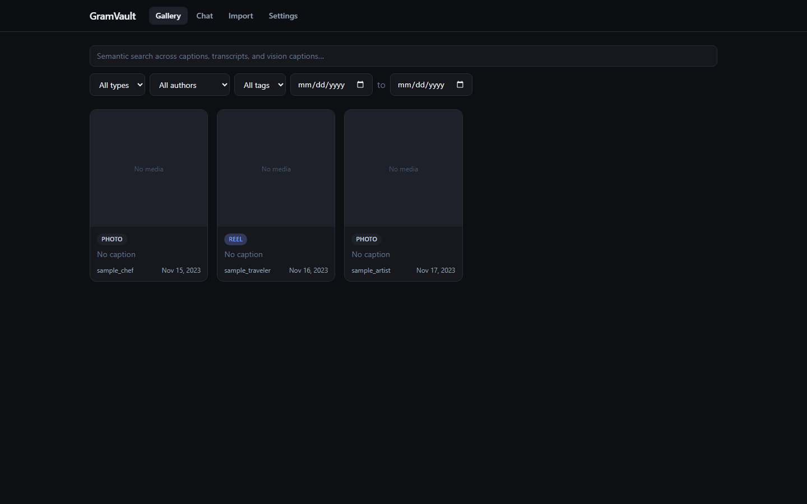
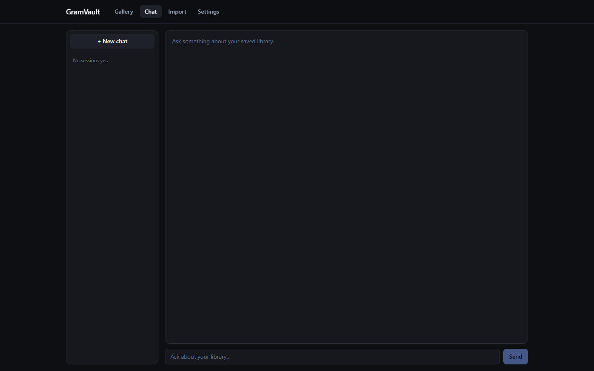
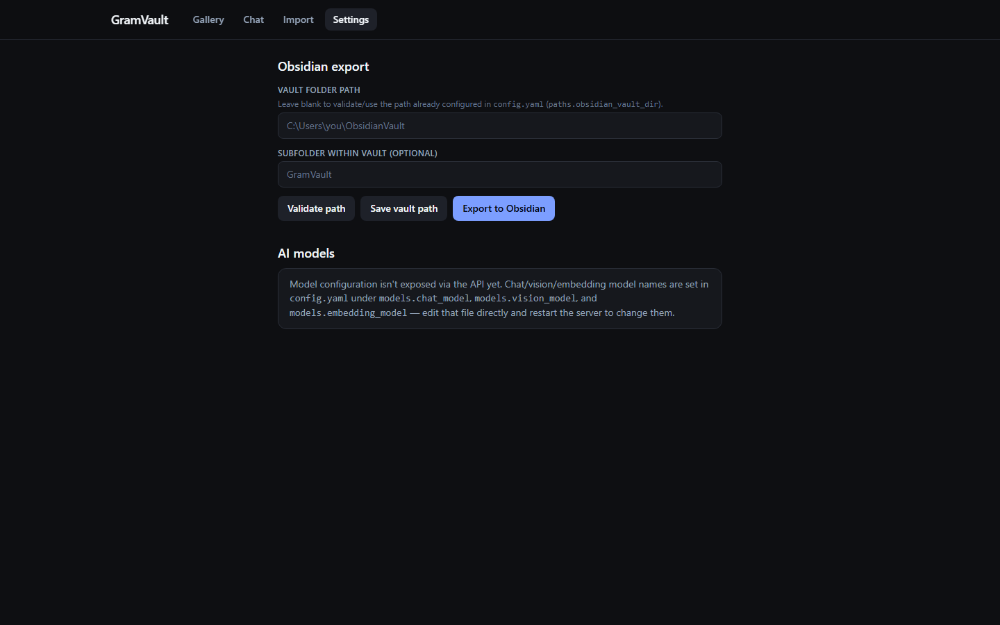
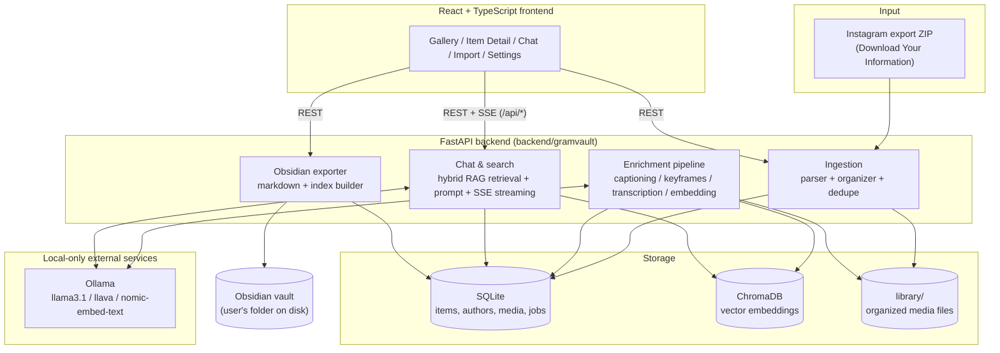

# GramVault

**Your saved Instagram posts, reels, and photos — as a private, searchable, local-first library with an AI chatbot and one-click Obsidian export.**

GramVault never talks to Instagram, never scrapes, and never phones home. It reads the official "Download Your Information" export you already have permission to download, builds a local library out of it (SQLite + ChromaDB), and lets you browse, search, and chat with your own saved content using a local LLM through [Ollama](https://ollama.com). Everything stays on your machine.

---

## Contents

- [Screenshots](#screenshots)
- [Features](#features)
- [Quickstart](#quickstart)
- [Architecture](#architecture)
- [Model requirements](#model-requirements)
- [Getting your Instagram data](#getting-your-instagram-data)
- [FAQ](#faq)
- [Privacy](#privacy)
- [Contributing](#contributing)
- [License](#license)

---

## Screenshots

*All screenshots use the bundled demo fixture (`tests/fixtures/sample_export.zip`) — no real user data.*

**Gallery** — your saved items in a filterable grid (type, author, tags, date range) with semantic search:



**Chat** — ask questions about your library; answers stream in with citation chips linking back to items:



**Settings** — point GramVault at your Obsidian vault and export your whole library as Markdown notes:



## Features

- **Import** — drag-and-drop (or `gramvault import <zip>` on the CLI) an Instagram "Download Your Information" JSON export. Own posts, saved posts, photos, videos, and reels are parsed, deduplicated by content hash, and organized into a local library.
- **Enrichment pipeline** — a resumable background pipeline that captions images (`llava`), extracts keyframes from videos/reels (`ffmpeg`) and captions those too, transcribes video/audio (`faster-whisper`), and embeds everything (`nomic-embed-text`) into a local ChromaDB vector store.
- **Gallery** — browse your whole library with filtering by type, author, and date.
- **Chat with citations** — ask natural-language questions about your saved content ("what recipes did I save last spring?") and get streamed answers from a local LLM, grounded in hybrid (keyword + semantic) retrieval over your library, with inline `[[item:<id>]]` citation chips linking straight back to the source item.
- **Obsidian export** — one click turns your library (or a selection of it) into a folder of Markdown notes with YAML frontmatter and a Dataview-friendly index, ready to drop into an existing Obsidian vault. Re-exporting is idempotent — it updates notes in place rather than duplicating them.

## Quickstart

### Prerequisites

- [Python 3.11+](https://www.python.org/downloads/)
- [Node 18+](https://nodejs.org/)
- [ffmpeg](https://ffmpeg.org/download.html) on your `PATH`
- [Ollama](https://ollama.com/download), installed and reachable at `http://localhost:11434`

Pull the three models GramVault uses by default:

```bash
ollama pull llama3.1:8b
ollama pull llava:7b
ollama pull nomic-embed-text
```

### Setup

```bash
git clone https://github.com/<your-fork>/gramvault.git
cd gramvault

# macOS / Linux
./setup.sh

# Windows (PowerShell)
./setup.ps1
```

The setup script creates a Python virtual environment, installs the backend in editable mode, and builds the frontend.

### Run it

```bash
gramvault serve
```

Visit **http://localhost:8000**, then either:

- go to **Import** and upload your own Instagram export ZIP, or
- try it out first with the bundled demo fixture: `gramvault import tests/fixtures/sample_export.zip`

## Architecture



Data flow, in short: a ZIP import populates SQLite and the local `library/` media folder → the enrichment pipeline walks unprocessed items, calls Ollama for captions/embeddings and ffmpeg/faster-whisper for video, and writes results into SQLite + ChromaDB → the Gallery and Chat pages read from those stores (Chat additionally streams responses live from Ollama) → the Obsidian exporter reads the same SQLite data and renders it out as Markdown into a vault folder you point it at.

## Model requirements

GramVault talks to Ollama only — nothing is downloaded from GramVault itself. Pull whatever you plan to use with `ollama pull <model>`.

| Model | Purpose | Approx. size (disk / RAM) | Pull command |
|---|---|---|---|
| `llama3.1:8b` | Default chat model — answers questions grounded in retrieved library context | ~4.7 GB / 8 GB+ RAM | `ollama pull llama3.1:8b` |
| `llava:7b` | Vision model — captions photos and video keyframes during enrichment | ~4.5 GB / 8 GB+ RAM | `ollama pull llava:7b` |
| `nomic-embed-text` | Embedding model — turns captions/transcripts/text into vectors for ChromaDB | ~275 MB / 2 GB+ RAM | `ollama pull nomic-embed-text` |

**Configurable alternatives.** The chat model (`models.chat_model` in `config.yaml`) is just a name passed to Ollama — swap it for anything you've pulled that supports chat completion, for example:

| Alternative chat model | Notes | Pull command |
|---|---|---|
| `qwen2.5:7b` | Strong general-purpose alternative, similar footprint to `llama3.1:8b` | `ollama pull qwen2.5:7b` |
| `kimi-k2` (or another Kimi-family model available on Ollama) | Larger, more capable option if you have the RAM/VRAM to spare | `ollama pull kimi-k2` |

After pulling an alternative, update `config.yaml`:

```yaml
models:
  chat_model: "qwen2.5:7b"
```

## Getting your Instagram data

GramVault only reads Instagram's official data export — it never logs into your account or scrapes anything.

1. Open Instagram (app or [instagram.com](https://www.instagram.com)).
2. Go to **Settings → Accounts Center → Your information and permissions**.
3. Choose **Download your information**.
4. Select your account, choose **Some of your information** (or all of it), and make sure **Saved** and **Posts** are included.
5. Set the format to **JSON** (GramVault does not support Instagram's older HTML export format) and include media.
6. Instagram will email you a link when the export is ready — download the ZIP and import it into GramVault (drag-and-drop on the Import page, or `gramvault import <zip>` on the CLI).

## FAQ

**"Ollama not running" error.** GramVault couldn't reach `http://localhost:11434`. Start Ollama (`ollama serve`, or launch the Ollama app) and try again — the in-app error message tells you exactly this.

**"Model not pulled" error.** The chat/vision/embedding model configured in `config.yaml` isn't in `ollama list` yet. Run the `ollama pull <model>` command shown in the error (see [Model requirements](#model-requirements)) and retry.

**"Wrong ZIP format" / import fails immediately.** GramVault only understands Instagram's **JSON** "Download Your Information" export — not the older HTML export, and not an arbitrary ZIP of photos. The import error message tells you which format it detected and how to re-request the correct one (see [Getting your Instagram data](#getting-your-instagram-data)).

**Why can't I see other people's saved photos/videos?** This is expected, not a bug. Instagram's official data export only includes the actual media *bytes* for your own posts. For posts you've saved from other accounts, the export contains link and metadata only (author, caption if available, timestamp, and a URL) — Instagram doesn't bundle a copy of someone else's media into your download. GramVault imports these as **link-only** items: you'll see the metadata and a link back to the original post, but no local media file, because Instagram never gave GramVault one to work with.

## Privacy

- **100% local.** Your library, database, vector store, and media files live entirely on your own disk.
- **No telemetry.** GramVault doesn't collect, transmit, or report usage data anywhere.
- **No external network calls**, except to `localhost` Ollama for AI inference — which is itself running on your machine.
- **Your data never leaves your machine.** There's no cloud sync, no account, no server GramVault talks to on your behalf.
- **Legitimate input only.** GramVault's only supported input is Instagram's official "Download Your Information" export, which you request and download yourself. There is no scraping, no stored Instagram login/credentials, and nothing here is intended to violate Instagram's Terms of Service.

## Contributing

See [CONTRIBUTING.md](CONTRIBUTING.md) for dev environment setup, test commands, and PR guidelines.

## License

[MIT](LICENSE)
